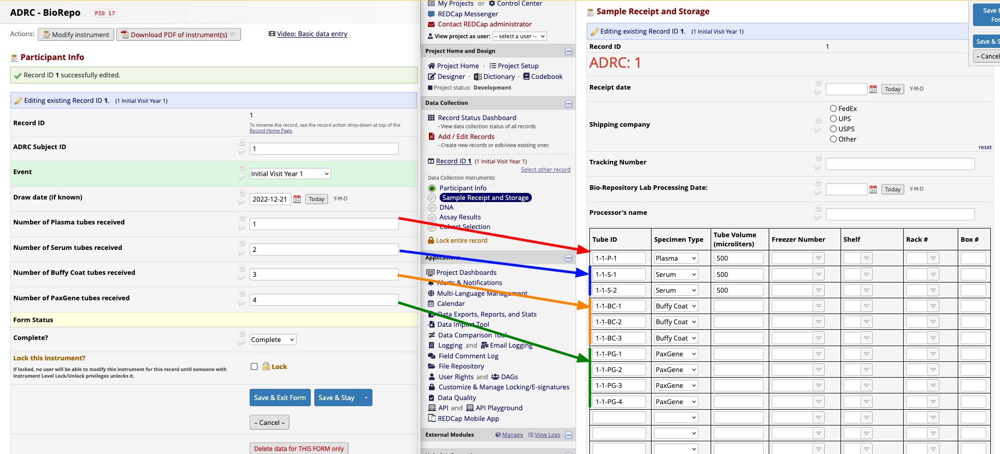

# ADRC Biorepository Tube ID Writer

A REDCap Module built specifically for the University of Florida's ADRC Biorepository project. This module reads a subject ID and counts of biospecimen tubes from REDCap a static list of REDCap fields to create tube-count records for each tube type. The code adds static data to generate and set tube IDs in a prescribed order. It also sets default values for tube volume on each tube.

If you aren't part of UF CTSIT you probably don't want to use this!

More generally useful modules:

- [Search and Populate Data From Another Project (SAPDAP)](https://github.com/ctsit/search_and_populate_data_from_another_project)
  - Fill fields in one project with data from a different project
- [Auto Populate Fields](https://github.com/ctsit/auto_populate_fields)
  - Fill fields in one project with data from another form in the same project

## Prerequisites
- REDCap >= 12.4.2

## Manual Installation
- Clone this repo into `<redcap-root>/modules/adrc_biorepository_tube_id_writer_v0.0.0`.
- Go to **Control Center > External Modules** and enable _ADRC Biorepository Tube ID Writer_.
- For each project you want to use this module, go to the project home page, click on **Manage External Modules** link, and then enable _ADRC Biorepository Tube ID Writer_ for that project.

## Configuration
- **Enabled forms**
    - **Show in this form**: The target instrument where the new data will be written.

## Example

Here is a pictoral example of what the module does.

